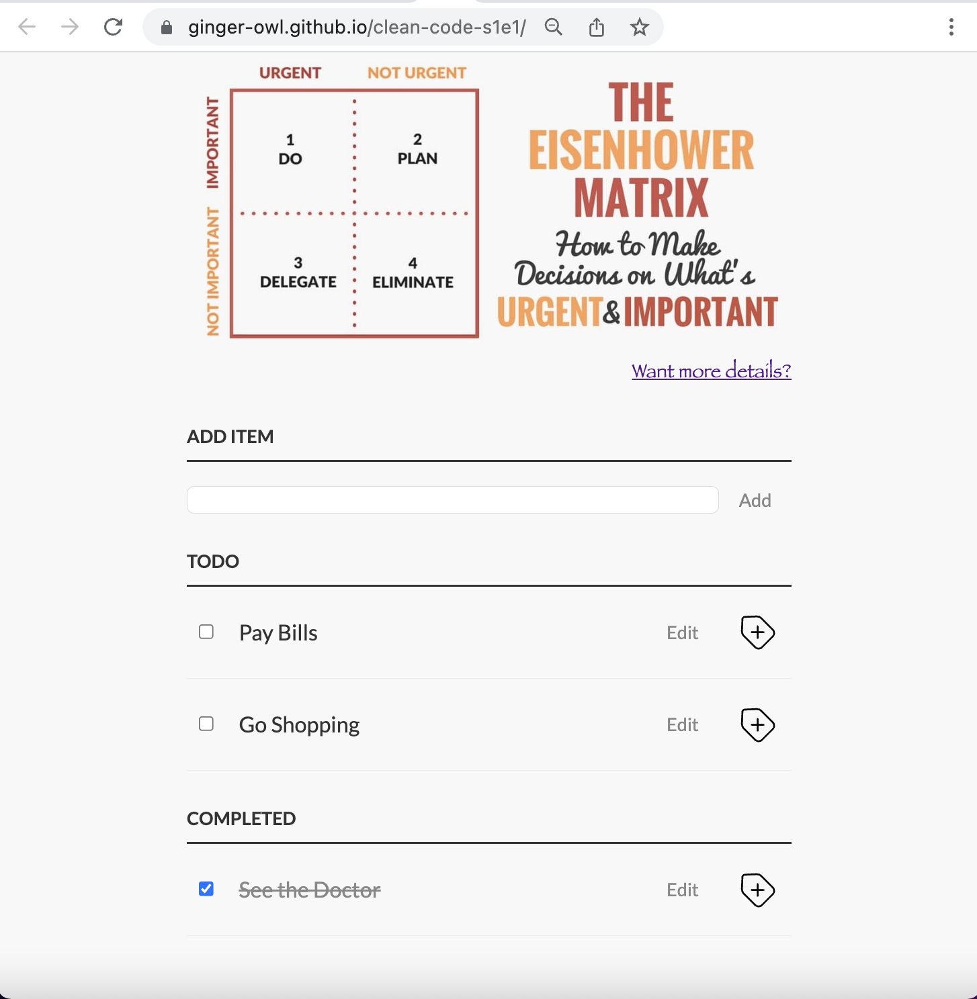

# Рефакторинг приложения TODO-list
## Проект 'Clean Code S1E1' курса JavaScript/Front-end 2022Q3 - [RS School](https://rs.school/)

### Ссылка на задание
[Здесь](https://github.com/rolling-scopes-school/tasks/blob/master/stage1/modules/clean-code/clean-code-s1e1.md)

### Ссылка на заделоенное приложение
[Нажми чтобы увидеть приложение](https://ginger-owl.github.io/clean-code-s1e1/)

### Функционал приложения :

    - Добавление нового элемента в список задач "TODO"
    - Редактирование элемента в списке задач "TODO"
    - Удаление элемента из списка задач "TODO"
    - Установка элемента в статус завершенного и перенос в список "COMPLETED" через checkbox

    - Удаление элемента из списка "COMPLETED"
    - Редактирование элемента из списка "COMPLETED"
    - Установка элемента в статус незавершенного и перенос в список "TODO" через checkbox
    - Анимация на кнопке удаления

### Дата завершения:
Сделано 29.10.2022 / Срок сдачи 01.11.2022